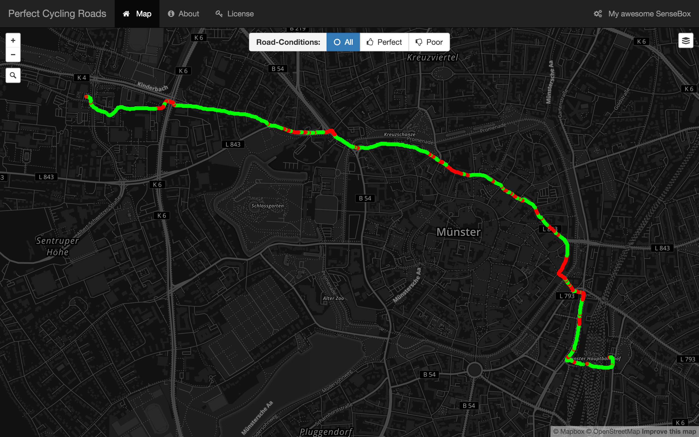

# SenseBox - Perfect Racing Bicycle Roads

This project is part of the course *SenseBox for People-Centered Urban Planning*, which took place at the [Institute for Geoinformatics, Münster](https://www.uni-muenster.de/Geoinformatics/en/index.html) in winter term 2015/16.

With the help of the [SenseBox](http://www.sensebox.de) we implemented an application for enthusiastic cyclists to find the perfect cycling roads for your next racing bicycle training or trip. Red dots indicates bad conditions, e.g. bumpy roads and/or slow speed. Green dots represents good cycling conditions. The application is based on crowd-sourcing, so citizens can measure everytime they ride their biciclyes and upload their measurements to the cloud. The application visualizes the tracks and calculates the cycling conditions. Based on the data, other people can plan their next trip and find betters ways for cycling. 

***

### Content of this repository

* Webserver & Client (Administration & Visualization) 
* [Install instructions](Server/README.md) (for Webserver & Client)
* [REST-API](API.md) (Documentation)
* Arduino-Sketch
* Recorded Test-Data (CSV-files)

***

### Contributors

:octocat: [Marius Runde](https://github.com/mrunde) 
:octocat: [Nicholas Schiestel](https://github.com/nicho90) 
:octocat: [Lukas Lohoff](https://github.com/LukasLohoff) 

***

### The MIT License (MIT)

**Copyright (c) 2016 Lukas Lohoff, Marius Runde, Nicholas Schiestel**

Permission is hereby granted, free of charge, to any person obtaining a copy
of this software and associated documentation files (the "Software"), to deal
in the Software without restriction, including without limitation the rights
to use, copy, modify, merge, publish, distribute, sublicense, and/or sell
copies of the Software, and to permit persons to whom the Software is
furnished to do so, subject to the following conditions:

The above copyright notice and this permission notice shall be included in all
copies or substantial portions of the Software.

THE SOFTWARE IS PROVIDED "AS IS", WITHOUT WARRANTY OF ANY KIND, EXPRESS OR
IMPLIED, INCLUDING BUT NOT LIMITED TO THE WARRANTIES OF MERCHANTABILITY,
FITNESS FOR A PARTICULAR PURPOSE AND NONINFRINGEMENT. IN NO EVENT SHALL THE
AUTHORS OR COPYRIGHT HOLDERS BE LIABLE FOR ANY CLAIM, DAMAGES OR OTHER
LIABILITY, WHETHER IN AN ACTION OF CONTRACT, TORT OR OTHERWISE, ARISING FROM,
OUT OF OR IN CONNECTION WITH THE SOFTWARE OR THE USE OR OTHER DEALINGS IN THE
SOFTWARE.
